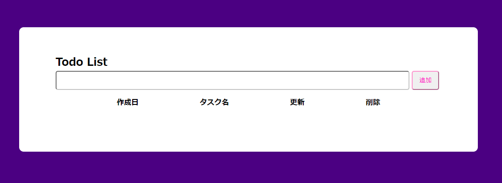

# アプリケーション
## 概要説明
>
>Todo(タスク)をリスト化して表示します。  
>登録したTodoは内容の更新,削除が出来ます。

## 目的
>Todoのリマインド

## 機能一覧
>Todoの登録,内容更新,削除

## 使用技術（実行環境）
>Laravel Framework 8.83.18

## テーブル設計
>

## ER図
>

## 環境構築
>**プロジェクトをクローン**  
>`cd clone https://github.com/alogon10/todolist`  
>**vendarディレクトリの作成**  
>`cd todolist`  
>`composer install`  
>**サーバーの起動**  
>`php artisan serve`  
>**.envの作成と設定**  
>`cp .env.example .env`  
>`php artisan key:generate`  
>`php artisan config:clear`  
>**データベース設定**  
>`php artisan migrate`
